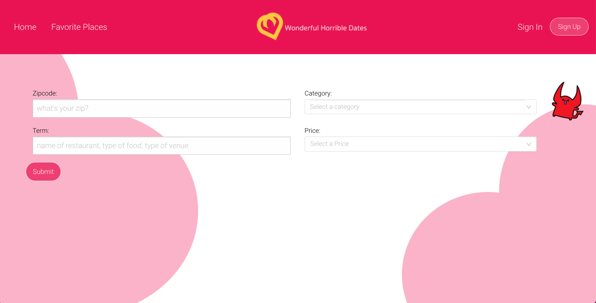
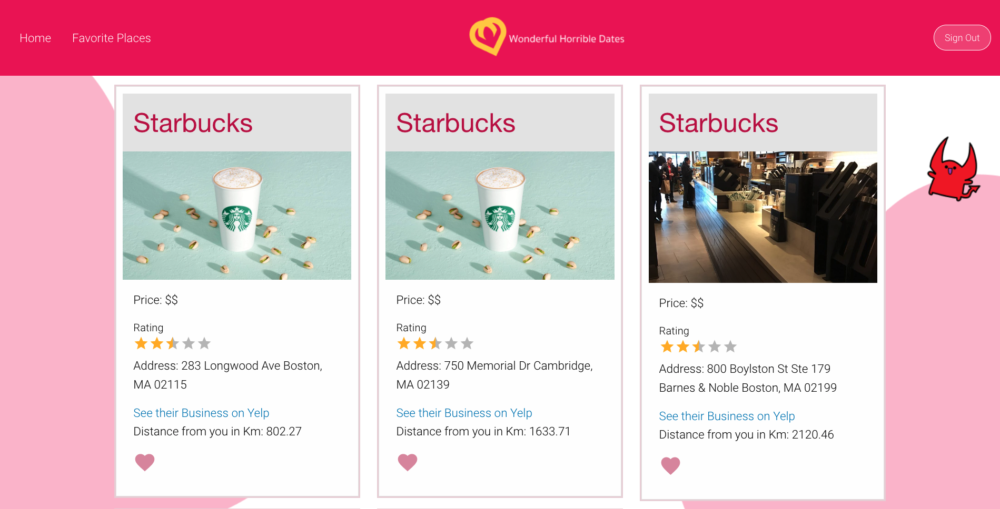

# The Wonderful Horrible Dates App

## Installation

1. yarn install
2. cd server
3. createdb \_development
4. yarn run migrate:latest
5. yarn run dev
6. Navigate to localhost:3000/

## Heroku Link

[The Wonderful Horrible Dates App](https://wades.herokuapp.com/)

## Usage

1. After following the Installation instructions Navigate to in your browser (http://localhost:3000/) to visit the home page
   

   

## Technology Used

- Express
- React
- Node.js
- Passport
- Objection
- Knex
- PostgreSQL
- Material-UI
- Ant-Design
